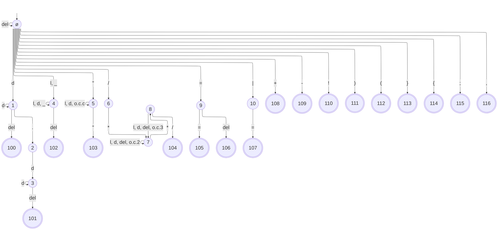

# AFD — PdL-JS

```mermaid
%%{init: {"flowchart": {"defaultRenderer": "elk", "curve": "basis", "useMaxWidth": false, "nodeSpacing": 120, "rankSpacing": 200, "padding": 30}, "themeVariables": {"fontSize": "26px"}}}%%
flowchart
    ini[ ]:::oculto --> q0
    q0 -- "del" --> q0
    q0((ø)) -- "d" --> q1((1))
    q1 -- "d" --> q1
    q1 -- "del" --> q100(((100)))
    q1 -- "." --> q2((2))
    q2 -- "d" --> q3((3))
    q3 -- "d" --> q3
    q3 -- "del" --> q101(((101)))
    q0 -- "l, _" --> q4((4))
    q4 -- "l, d, _" --> q4
    q4 -- "del" --> q102(((102)))
    q0((ø)) -- "#quot;" --> q5((5))
    q5 -- "l, d, o.c.c" --> q5
    q5 -- "#quot;" --> q103(((103)))
    q0 -- "/" --> q6((6))
    q6 -- "*" --> q7((7))
    q7 -- "l, d, del, o.c.2" --> q7
    q7 -- "*" --> q8((8))
    q8 -- "l, d, del, o.c.3" --> q7
    q8 -- "/" --> q104(((104)))
    q0 -- "=" --> q9((9))
    q9 -- "=" --> q105(((105)))
    q9 -- "del" --> q106(((106)))
    q0 -- "|" --> q10((10))
    q10 -- "=" --> q107(((107)))
    q0 -- "+" --> q108(((108)))
    q0 -- "-" --> q109(((109)))
    q0 -- "!" --> q110(((110)))
    q0 -- ")" --> q111(((111)))
    q0 -- "(" --> q112(((112)))
    q0 -- "}" --> q113(((113)))
    q0 -- "{" --> q114(((114)))
    q0 -- ";" --> q115(((115)))
    q0 -- "," --> q116(((116)))

    classDef oculto fill:none,stroke:none,color:none

```